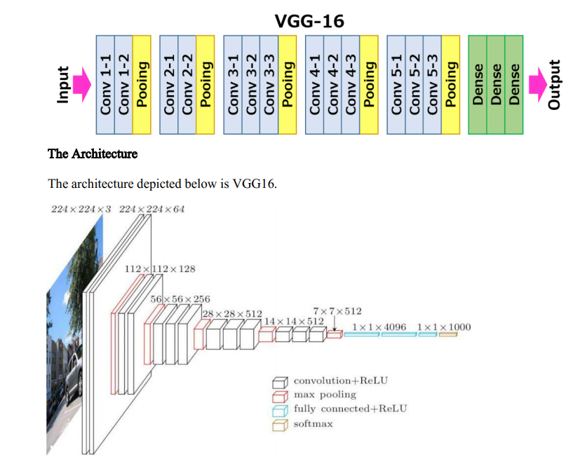
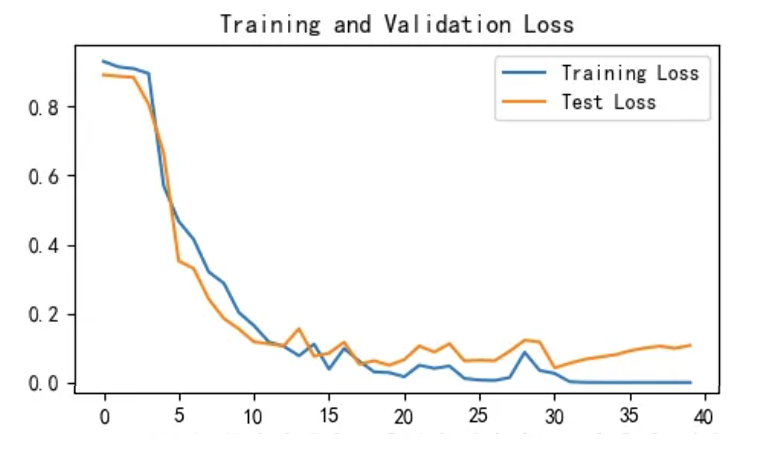
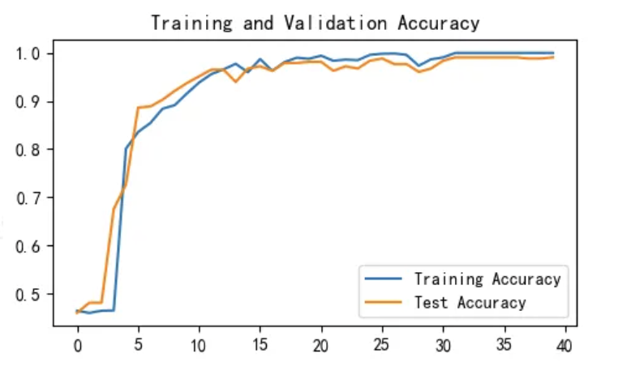

# Potato Disease Classification Using VGG-16

## 1. Overview
This repository presents a project for classifying potato plant diseases using the VGG-16 architecture implemented in PyTorch.  
The objective is to distinguish between three classes: Early Blight, Late Blight, and Healthy leaves, based on high-resolution images of potato plants.  
It aims to help develop and test image recognition models for accurate disease detection and classification, thus advancing agricultural diagnostics.  
The dataset is already provided in the uploaded code, named `PotatoPlants`.

## 2. Model Used

VGG-16 is a convolutional neural network (CNN) architecture developed by the Visual Geometry Group at the University of Oxford. It is designed for image classification tasks and is known for its simplicity and depth. The "16" in its name refers to the 16 weight layers in the network, which include 13 convolutional layers and 3 fully connected layers.   
VGG-16 employs small 3x3 convolutional filters, which allow for deeper network structures while maintaining a manageable number of parameters. The architecture also includes max pooling layers to reduce spatial dimensions and enable hierarchical feature extraction.   
VGG-16 has been widely used as a pre-trained model in transfer learning due to its strong performance on various image classification benchmarks.
 

  

## 3. Model Evaluation
The training/validation loss is presented below:

  

The training/validation accuracy is presented below:

  

